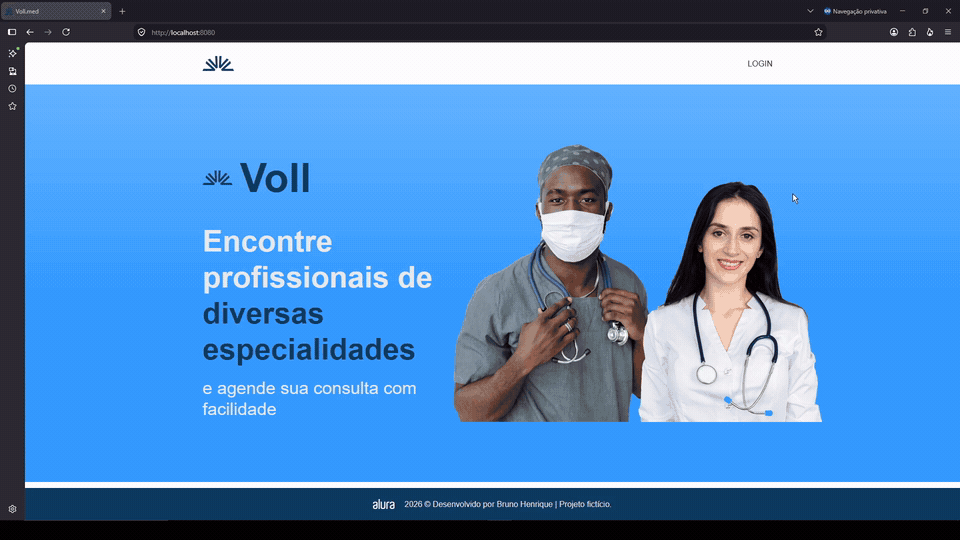

# 🩺 Vollmed-API

> **🔐Segurança não é apenas permitir a entrada — é garantir que cada usuário acesse somente o que precisa e não acesse a informação de terceiros.**

O **Vollmed** é uma aplicação web desenvolvida com **Java e Spring Boot**, com foco em **segurança, autenticação, autorização e controle de acesso utilizando Spring Security**.

O projeto simula o gerenciamento de uma clínica médica e integra **backend, interface web e banco de dados**, com operações CRUD, diferentes perfis de usuário e permissões específicas para cada tipo de acesso.

## 🎬 Demonstração

<p align="center">
  
</p>

## 🔐 Segurança com Spring Security

A segurança é um dos principais pontos deste projeto.

A aplicação trabalha com três perfis de acesso:

- **ATENDENTE**
- **MÉDICO**
- **PACIENTE**

Cada perfil possui permissões específicas, permitindo controlar quais páginas e funcionalidades podem ser acessadas pelo usuário autenticado.

Durante o desenvolvimento, trabalhei com:

- autenticação e autorização com **Spring Security**;
- controle de acesso baseado em perfis;
- login e logout;
- persistência de usuários no banco de dados;
- proteção de senhas utilizando **BCrypt**;
- gerenciamento de sessões e cookies;
- proteção contra **CSRF**;
- Remember Me;
- integração entre Spring Security e **Thymeleaf**;
- alteração de senha;
- recuperação de senha utilizando tokens;
- envio de links de recuperação por e-mail.

## 💻 Backend + Frontend

Além da camada de segurança, o Vollmed possui funcionalidades de **CRUD (Create, Read, Update e Delete)** para o gerenciamento de médicos, pacientes e consultas, conectando as regras de negócio do backend à interface web.

No backend, foram utilizados **Java, Spring Boot, Spring Data JPA e Hibernate** para estruturar a aplicação, trabalhar com as entidades e realizar a persistência dos dados na aplicação.

No frontend, a aplicação utiliza **Thymeleaf, HTML e CSS**, permitindo customizar, renderizar as páginas e integrar as permissões do Spring Security diretamente à interface apresentada para cada usuário.

Os dados são persistidos em **MySQL**, enquanto o **Flyway** é utilizado para versionar e aplicar alterações na estrutura do banco através de migrations.

## 🛠️ Tecnologias utilizadas

### Backend

- Java
- Spring Boot
- Spring Security
- Spring Data JPA
- Hibernate
- Maven

### Frontend

- Thymeleaf
- HTML
- CSS

### Banco de dados

- MySQL
- Flyway

### Segurança

- Spring Security
- BCrypt
- CSRF
- Autenticação baseada em sessão
- Autorização baseada em perfis

## ⚙️ Como executar

Para executar o projeto localmente, é necessário ter **Java** e **MySQL** configurados na máquina.

### 1. Configure as variáveis de ambiente

As credenciais utilizadas pela aplicação não são armazenadas diretamente no código-fonte.

Para a conexão com o MySQL, configure:

```text
DB_USERNAME=seu_usuario_mysql
DB_PASSWORD=sua_senha_mysql
```

O projeto utiliza a seguinte configuração de banco:

```text
jdbc:mysql://localhost/vollmed_web?createDatabaseIfNotExist=true
```

Portanto, a aplicação utiliza o banco `vollmed_web`, que poderá ser criado caso ainda não exista.

### 2. Configure o envio de e-mails

Para utilizar as funcionalidades que dependem do envio de e-mails, configure também:

```text
EMAIL_USERNAME=seu_email
EMAIL_PASSWORD=sua_credencial_de_email
```

> As informações de acesso ao banco e ao serviço de e-mail são obtidas através de variáveis de ambiente, evitando a exposição de credenciais no repositório.

### 3. Execute a aplicação

No Windows:

```bash
mvnw.cmd spring-boot:run
```

No Linux/macOS:

```bash
./mvnw spring-boot:run
```

Com o MySQL disponível e as variáveis de ambiente configuradas, o **Flyway** aplica as migrations necessárias durante a inicialização da aplicação.

## 🧠 O que eu abordei e pratiquei neste projeto

Mais do que implementar uma tela de login, este projeto me deu a compreensão entender melhor como a segurança faz parte do funcionamento de uma aplicação web.

Na prática, trabalhei a diferença entre **autenticação** — identificar quem está logando na aplicação — e **autorização** — definir quais recursos aquele usuário pode utilizar de acordo com o seu nível.

Aprofundei conhecimentos em:

- desenvolvimento web com **Java e Spring Boot**;
- Programação Orientada a Objetos (POO);
- operações **CRUD**;
- autenticação e autorização;
- controle de acesso baseado em perfis;
- persistência com **Spring Data JPA e Hibernate**;
- banco de dados **MySQL**;
- migrations com **Flyway**;
- proteção e armazenamento de senhas;
- gerenciamento de sessões;
- integração entre backend e frontend com **Thymeleaf**.

## 🎓 Contexto

Projeto desenvolvido durante os cursos:

- **Java e Spring Security: Proteja suas aplicações web**
- **Java e Spring Security: Crie perfis e autorize requisições**

Formação realizada na plataforma **Alura**.

---

### 👨‍💻 Autor

**Bruno Henrique**

Desenvolvedor com foco em **Java, Spring Boot e Backend**.